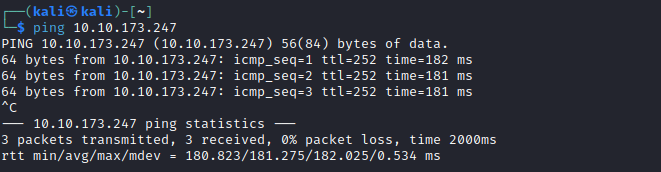
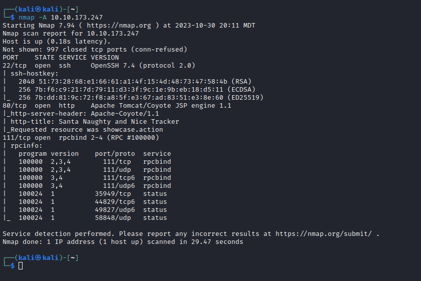
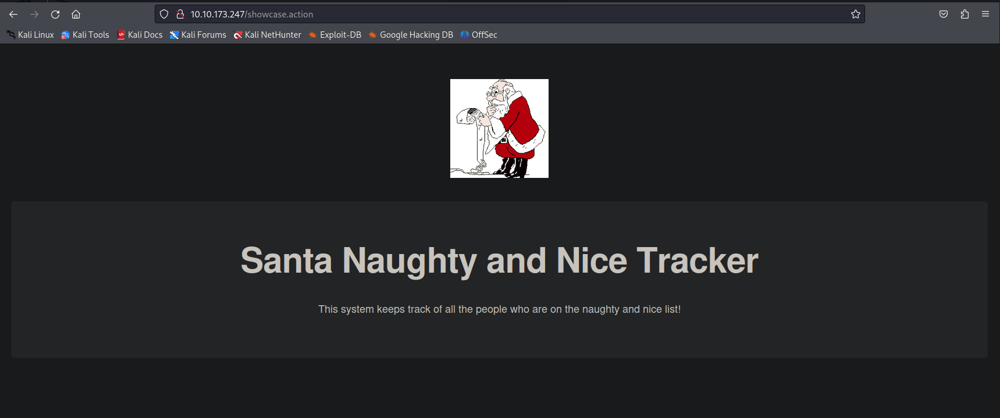

# [Day 10] Metasploit-a-ho-ho-ho Writeup
### Tags: `#Linux Webapp #Metasploit #Meterpreter`
#### [Machine Link](https://tryhackme.com/room/25daysofchristmas)


## Walkthrough

1.) Lets ping the machine to see if it is up and running.

```bash
ping 10.10.173.247
```



2.) Lets run a nmap scan on the machine to enumerate all services on open ports.

```bash
nmap -A 10.10.173.247
```



3.) Lets take a look at the Apache webapp running on port 80.



4.) Using the binary "find" and the SUID bit set, we can use the -exec flag to run commands of the owner of the bin. 

```bash
find flag1.txt -exec chmod 777 flag1.txt \;
or
find flag1.txt -exec cat flag1.txt \;
```


5.) The binary /usr/bin/system-control looks like a custom file and has the SUID bit set. Lets execute the bin and see if we can root on the machine.


## Tasks
| Task | Question | Answer |
| --- | --- | --- |
| Task #1 | What port is SSH running on? | 65534 |
| Task #2 | Find and run a file as igor. Read the file /home/igor/flag1.txt | THM{d3f0708bdd9accda7f937d013eaf2cd8} |
| Task #3 | Find another binary file that has the SUID bit set. Using this file, can you become the root user and read the /root/flag2.txt file? | THM{8c8211826239d849fa8d6df03749c3a2} |


