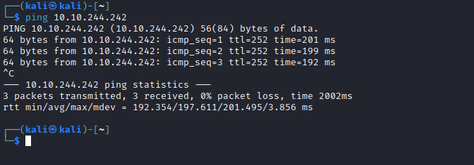
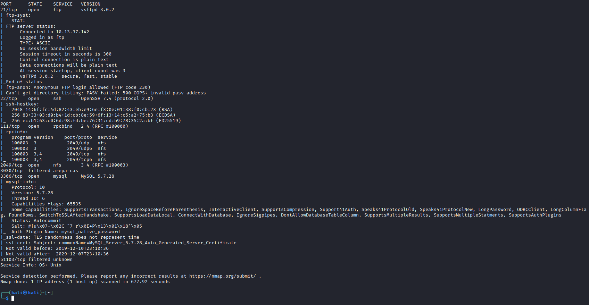
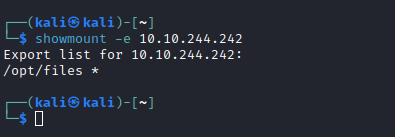
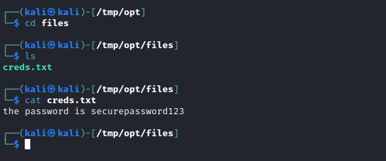
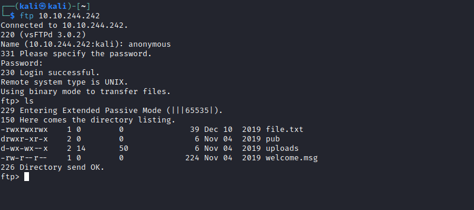
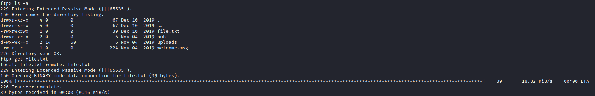
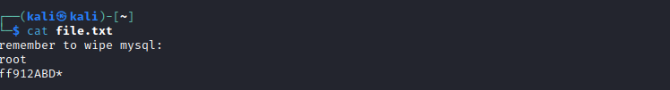
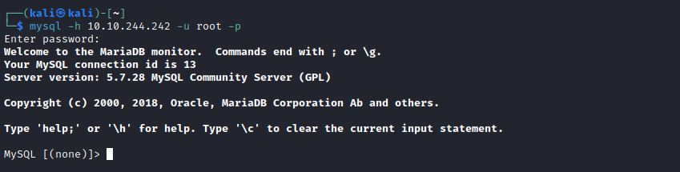
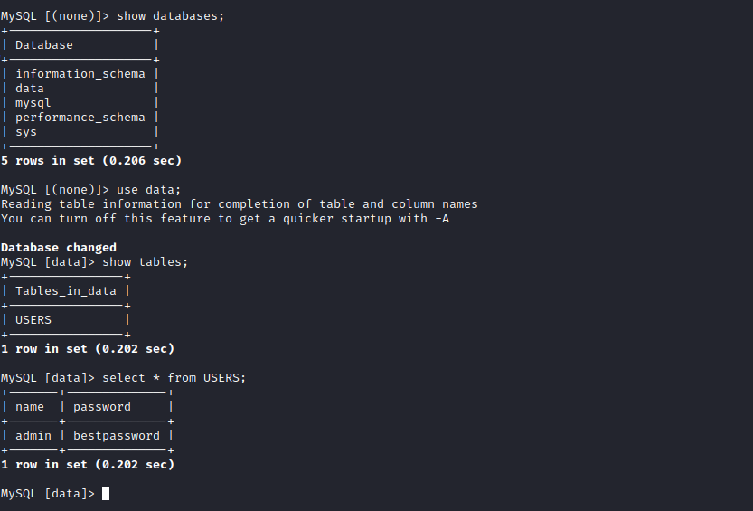

# [Day 11] Elf Applications Writeup
### Tags: `#FTP #NFS #MySQL`
#### [Machine Link](https://tryhackme.com/room/25daysofchristmas)


## Walkthrough

1.) Lets ping the machine to see if it is up and running.

```bash
ping 10.10.244.242
```



2.) Lets run a nmap scan on the machine to enumerate all services on open ports.

```bash
nmap -A 10.10.244.242
```



3.) Lets first take a look at the NFS service running on port 2049. We can enumerate all the shares using the showmount command.

```bash
showmount -e 10.10.244.242
```



4.) We can mount the share to our local system by using the mount command and at that point we can browse the share.

```bash
sudo mount -t nfs 10.10.244.242:/opt /tmp/opt
```


5.) With the share mounted to the local system, we can go to the tmp directory that was created. There is a interesting file called creds.txt, lets see what we can find in there.



6.) Once we are done with the share, we can unmount it from our local system by running the umount command.


7.) Next lets take a look at the FTP service running on port 21. The nmap scan shows that the anonymous login is enabled, We can enumerate this service using the ftp command.

```bash
ftp 10.10.244.242
```



8.) If we want to take a look at the file.txt contents we first need to download the file from the FTP server, the command to download the file to our local system is get. Once the download is complete we can exit the FTP service by typing exit and then we can display the contents of file.txt using the cat or vim command.




9.) The file found on the FTP service has what looks like a username and password for the MySQL service running on port 3306, lets try connecting with those creds.

```bash
mysql -h 10.10.244.242 -u root -p
```



10.) Now that we are connected to the mysql service, lets enumerate the DBRMs and see if we can find any information we can use for later.




## Tasks
| Task | Question | Answer |
| --- | --- | --- |
| Task #1 | What is the password inside the creds.txt file? | securepassword123 |
| Task #2 | What is the name of the file running on port 21? | file.txt |
| Task #3 | What is the password after enumerating the database? | bestpassword |


