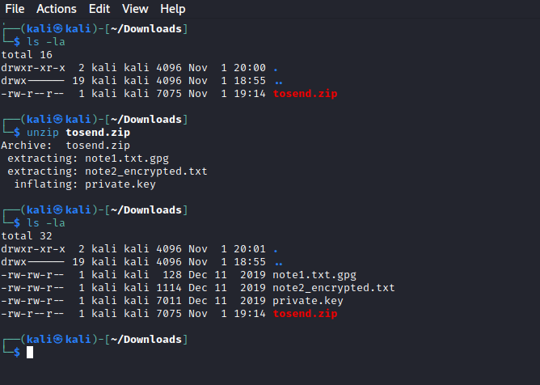
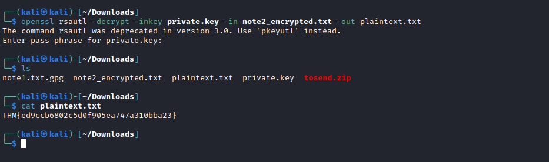

# [Day 12] Elfcryption Writeup
### Tags: `#Encryption #GPG #OpenSSL`
#### [Machine Link](https://tryhackme.com/room/25daysofchristmas)


## Walkthrough

1.) Lets download the task files and then unzip the tosend.zip file using the unzip command.

```bash
unzip tosend.zip
```


2.) Lets generate the md5 hash for the note1.txt.gpg file using the md5sum command.

```bash
md5sum note1.txt.gpg
```


3.) Next lets decrypt the note1.txt.gpg file using the key "25daysofchristmas" found from the task hint.

```bash
gpg -d note1.txt.gpg
```


4.) Last lets decrypt the note2_encrypted.txt using the private.key and the passphrase "hello" found from the task hint.

```bash
openssl rsautl -decrypt -inkey private.key -in note2_encrypted.txt -out plaintext.txt
```


## Tasks
| Task | Question | Answer |
| --- | --- | --- |
| Task #1 | What is the md5 hashsum of the encrypted note1 file? | 24cf615e2a4f42718f2ff36b35614f8f |
| Task #2 | Where was elf Bob told to meet Alice? | Santa's Grotto |
| Task #3 | Decrypt note2 and obtain the flag! | THM{ed9ccb6802c5d0f905ea747a310bba23} |


