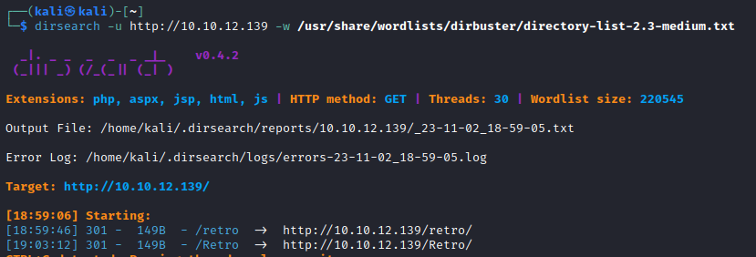

# [Day 13] Accumulate Writeup
### Tags: `#Windows WebApp #Wordpress #JuicyPotato`
#### [Machine Link](https://tryhackme.com/room/25daysofchristmas)


## Walkthrough

1.) Lets ping the machine ip and see if it is up and running. Im pretty sure this machine is ignoring ICMP.

```bash
ping 10.10.12.139
```


2.) Lets run a quick test nmap scan to double check that the machine is up and responding to other requests besides ICMP.

```bash
nmap 10.10.12.139
```


3.) Now that we confirmed that the machine is responding to a simple nmap scan, lets run a more in depth scan to enumerate all the running services on open ports.

```bash
nmap -A -p- 10.10.12.139
```


4.) Lets open the webapp running on port 80, we can see that it is a simple IIS default page.


5.) Since we dont see anything on the default webpage, lets run a dirsearch to find hidden directories. 

```bash
dirsearch -u http://10.10.12.139 -w /usr/share/wordlists/dirbuster/directory-list-2.3-medium.txt
```


6.) The dirsearch scan came back with /retro as a code 200 for the webapp, lets take a look at the webpage.


7.) After looking around, we clicked on a recent comment from the user Wade. This post has what looks like a password that he wanted to save for later. Also under the META sub-menu we can see both a Log in and WordPress.org links.


8.) Clicking on the Log in link, we are sent to a wordpress login page at /retro/wp-login.php. Lets try logging in with the username:password combo we found wade:parzival


9.) Looks like that was the correct admin creds as we are now logged into the wordpress admin dashboard. Upon looking at the dashboard we can see the wordpress version is 5.2.1


10.) Uaing the 404.php template located under Apperance -> Theme Editor, we can replace the default template with a php reverse shell to try and get initial access.


11.) Using the pentestmonkey (Linux Machine) or Ivan Sincek (Windows Machine) or revshells.com php reverse shell scripts, we can replace the default 404.php template for our exploit for initial access.


12.) With the 404.php file updated with the php reverse shell, we can start a netcat listener on our local machine and then execute the exploit by going to the location of the 404.php file.

```bash
nc -nvlp 1234
http://10.10.12.139/retro/wp-content/themes/90s-retro/404.php
```


## Tasks
| Task | Question | Answer |
| --- | --- | --- |
| Task #1 | A web server is running on the target. What is the hidden directory which the website lives on? | /retro |


