# [Day 1] Inventory Management Writeup
### Tags: `#Web App #Session Management #HTTP Cookies`
#### [Machine Link](https://tryhackme.com/room/25daysofchristmas)

## Walkthrough

1.) Lets ping the machine to see if it is up and running.

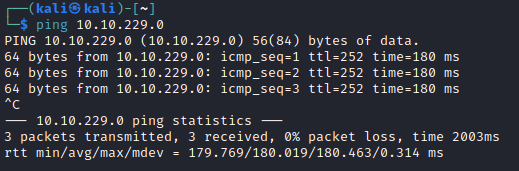

2.) Using the telnet tool, lets try and get a connection to port 3000, which is hosting the web app.

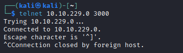

3.) Using the curl tool, lets get a response from the server.

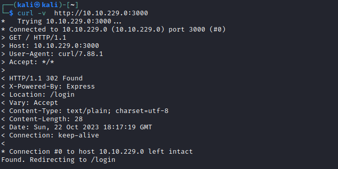

4.) After connecting to http://machineip:3000, we get redirected to the /login page. We can see there is no active HTTP cookies stored.

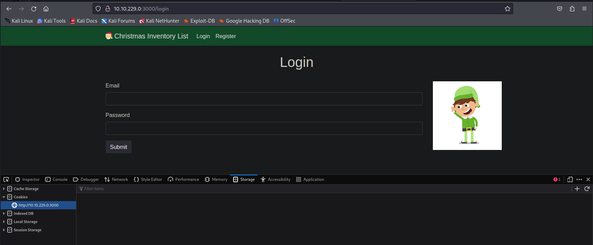

5.) Lets create a test account by visiting the /register page.

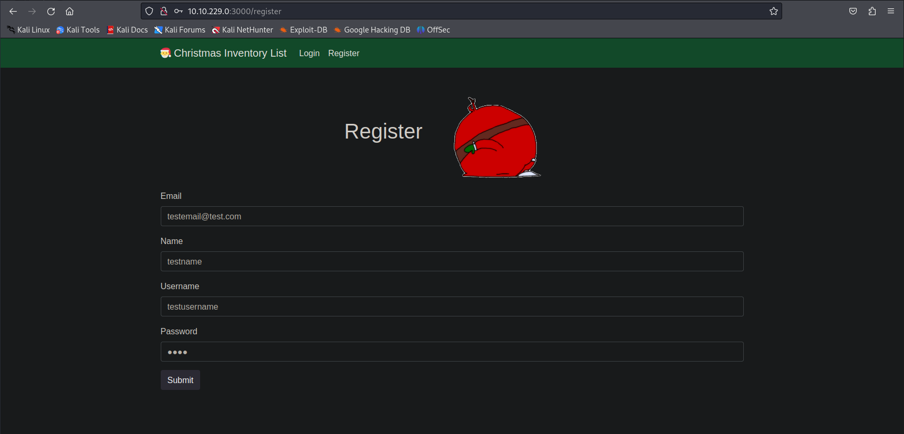

6.) After creating the test account, we can login using the username and password. Once we login we are redirected to the /home page. There is now a active cookie stored containing my auth information.

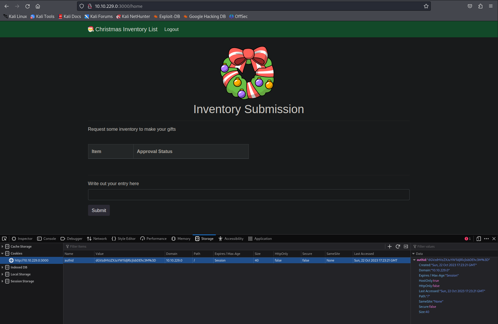

7.) Using the CLI tool base64, we can decode the HTTP cookie value. We can see the cookie is using the account's username with a fixed value attached at the end 'v4er9ll1!ss'.

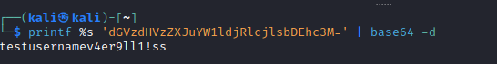

8.) Besides using the CLI, the online tool cyberchef will decode the HTTP cookie string as well.

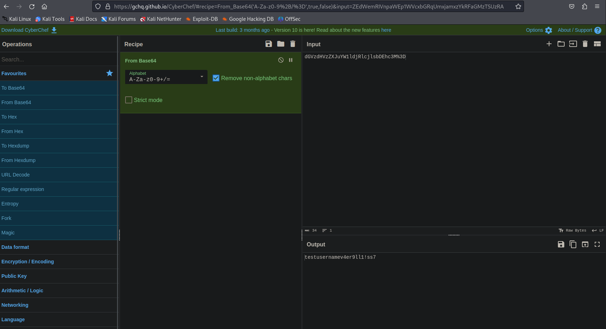

9.) Using the CLI tool base64, we can create a new auth HTTP cookie with the username 'mcinventory' along with the the fixed value 'v4er9ll1!ss'.

10.) Besides using the CLI, the online tool cyberchef can also be used to create a new auth HTTP cookie.

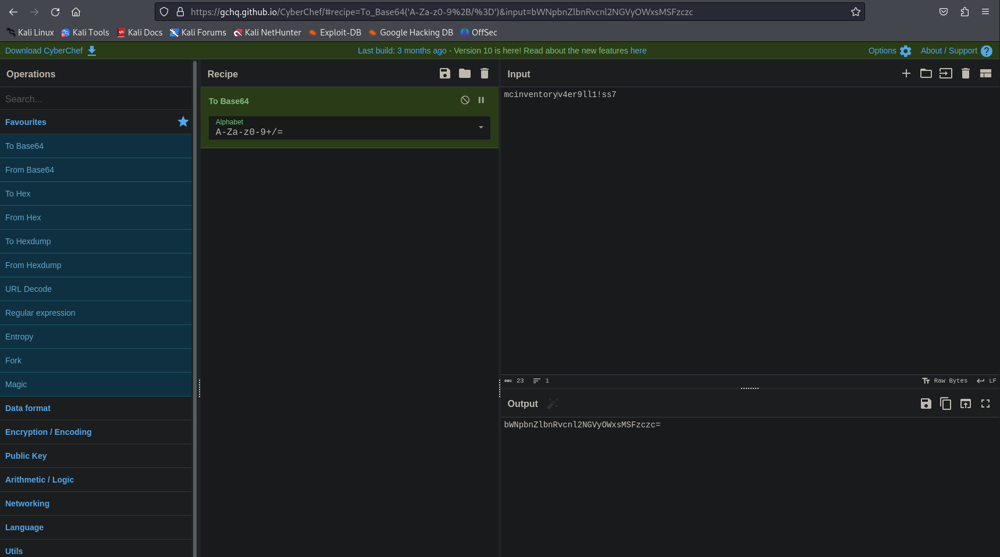

11.) If we replace the cookie's value with the new auth HTTP cookie, and reload the webpage.

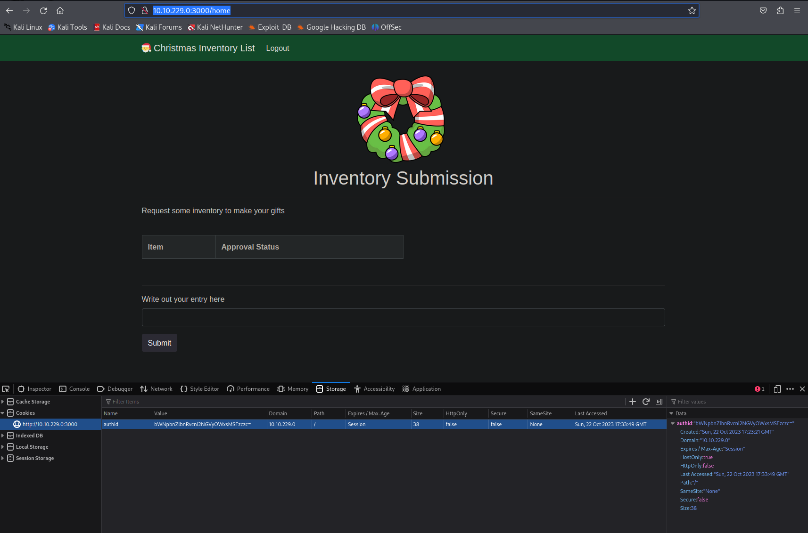

12.) We should now be logged in as mcinventory.

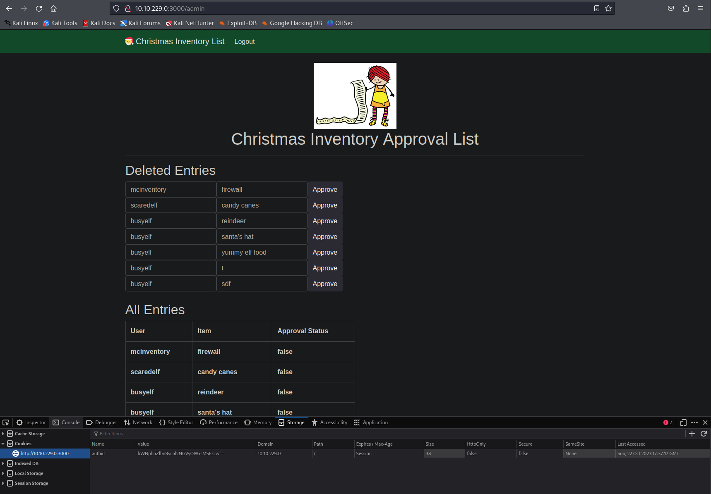

## Tasks
| Task | Question | Answer |
| --- | --- | --- |
| Task #1 | What is the name of the cookie used for authentication? | authid |
| Task #2 | If you decode the cookie, what is the value of the fixed part of the cookie? | v4er9ll1!ss |
| Task #3 | After accessing his account, what did the user mcinventory request? | firewall |
