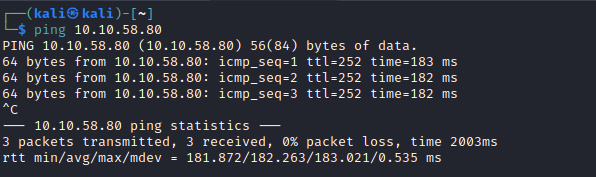
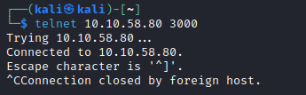
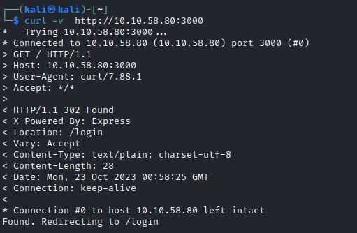
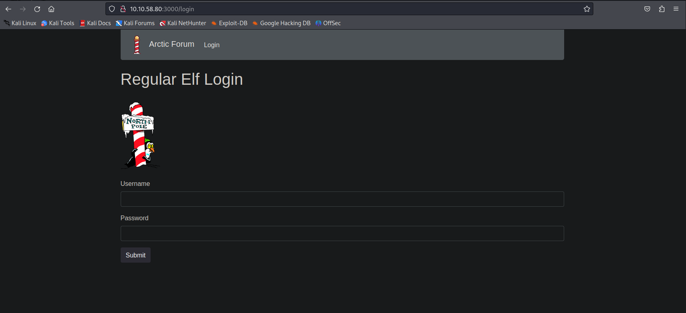
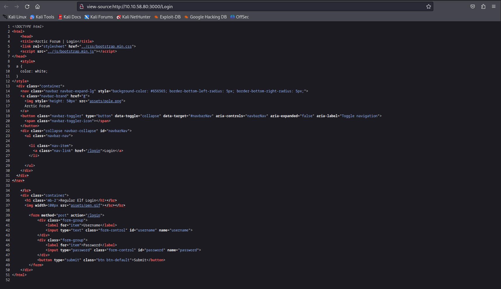
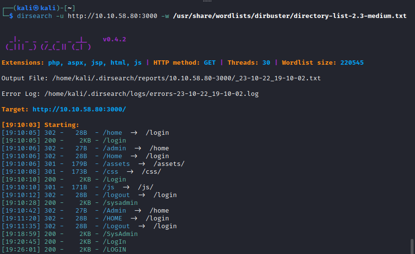
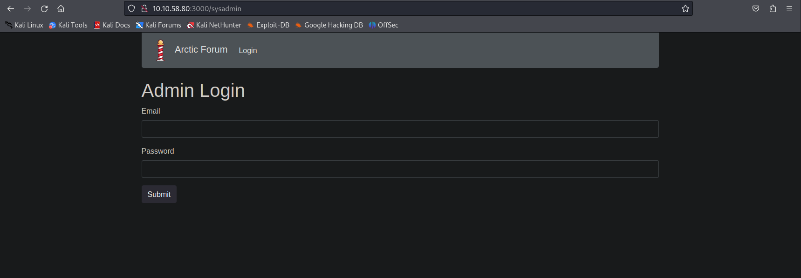
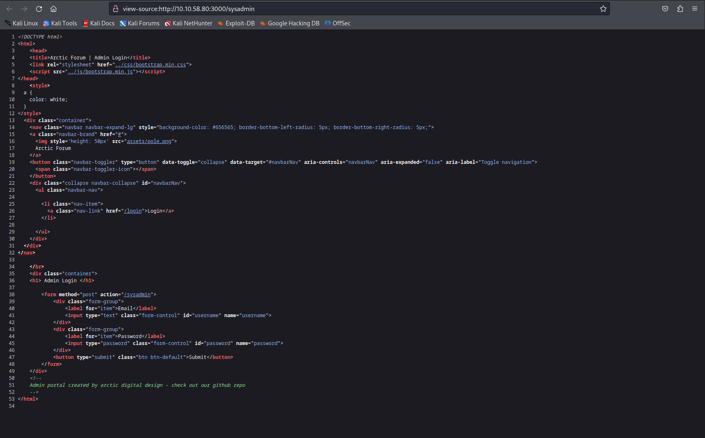
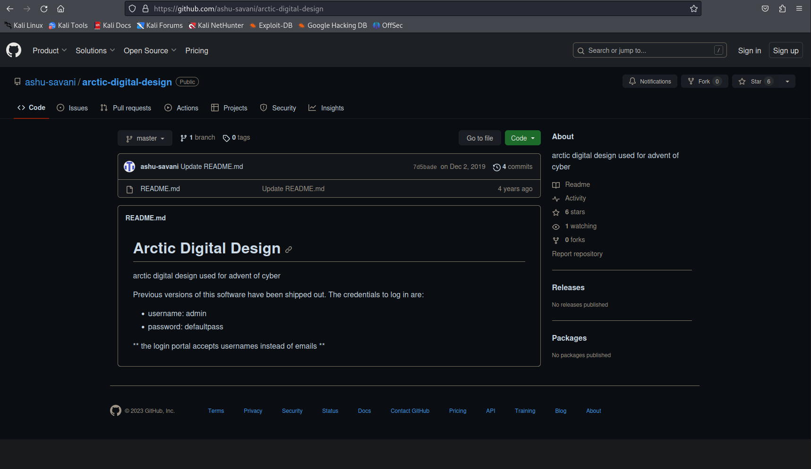
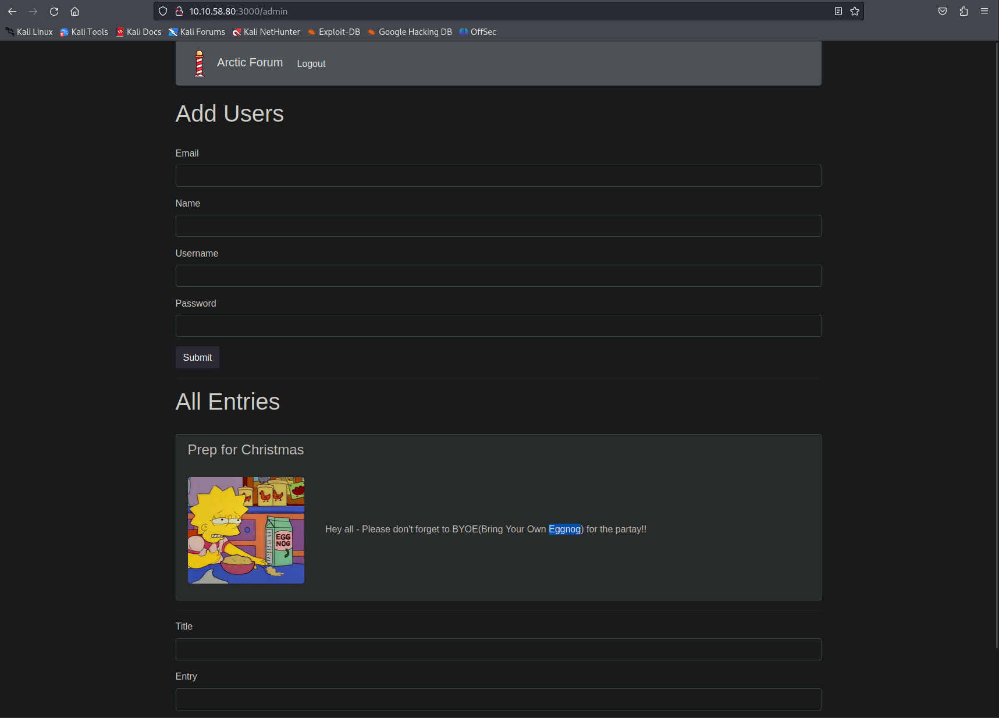

# [Day 2] Arctic Forum Writeup
### Tags: `#Web App #Brute Force Directories #Information Exposure`
#### [Machine Link](https://tryhackme.com/room/25daysofchristmas)

## Walkthrough

1.) Lets ping the machine to see if it is up and running.

2.) Using the telnet tool, lets try and get a connection to port 3000, which is hosting the web app.

3.) Using the curl tool, lets get a response from the server.

4.) After connecting to http://machineip:3000, we get redirected to the /login page. There is no register page available.

5.) Lets take a look at the view-source for the /login page for anything interesting.

6.) Using the dirsearch python tool, lets try and see if there are hidden directories that can be brute forced.

7.) The /sysadmin directory looks interesting, upon visiting we are granted access to the admin login page.

8.) Lets take a look at the view-source for the /sysadmin page for anything interesting. The comment at the bottom of the page telling us the admin portal was created by arctic digital design and to check out there repo is very important!

9.) Upon visiting the arctic digital design github repo, we can find default admin credentials.

10.) Using the default admin credentials, admin:defaultpass on the admin login page. We can login to the forum as a admin.

## Tasks
| Task | Question | Answer |
| --- | --- | --- |
| Task #1 | What is the path of the hidden page? | /sysadmin |
| Task #2 | What is the password you found? | defaultpass |
| Task #3 | What do you have to take to the 'partay' | Eggnog |

