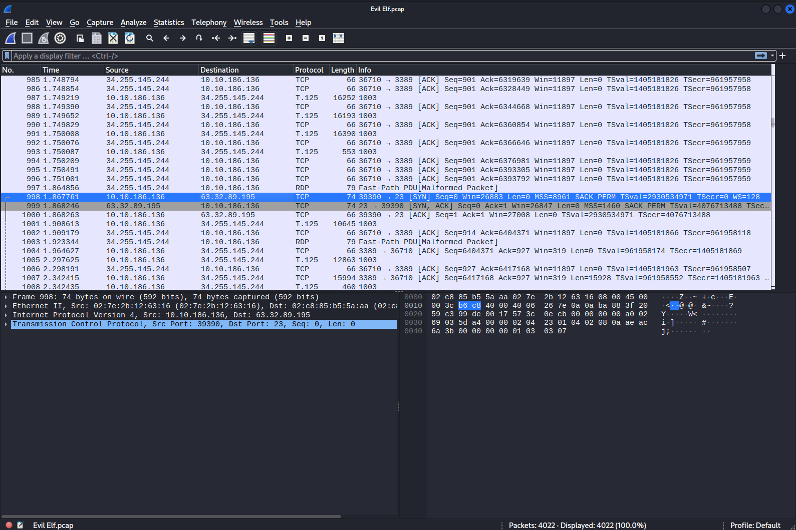
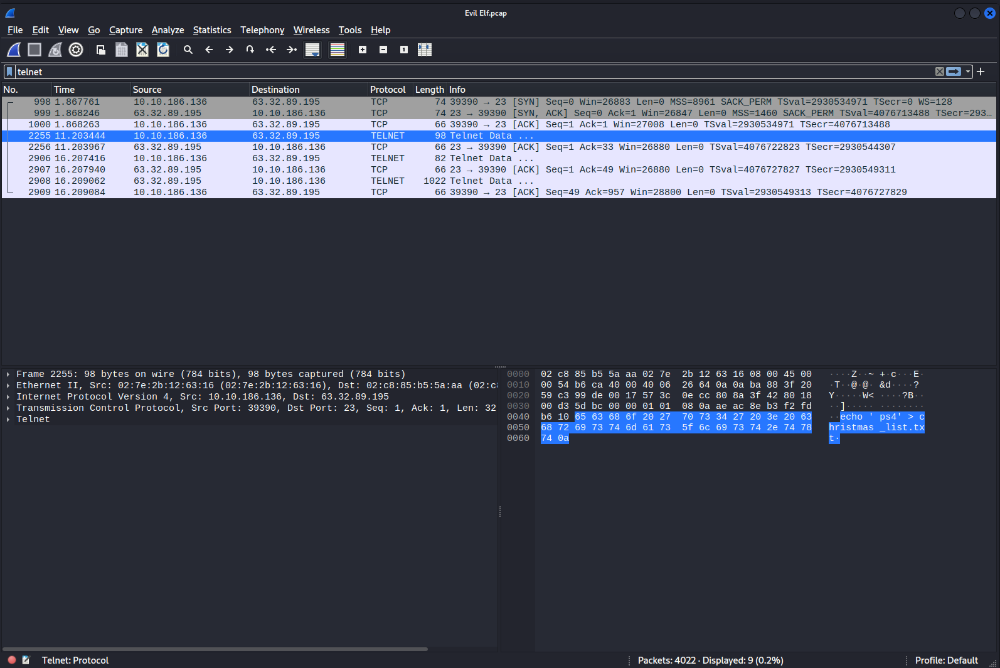
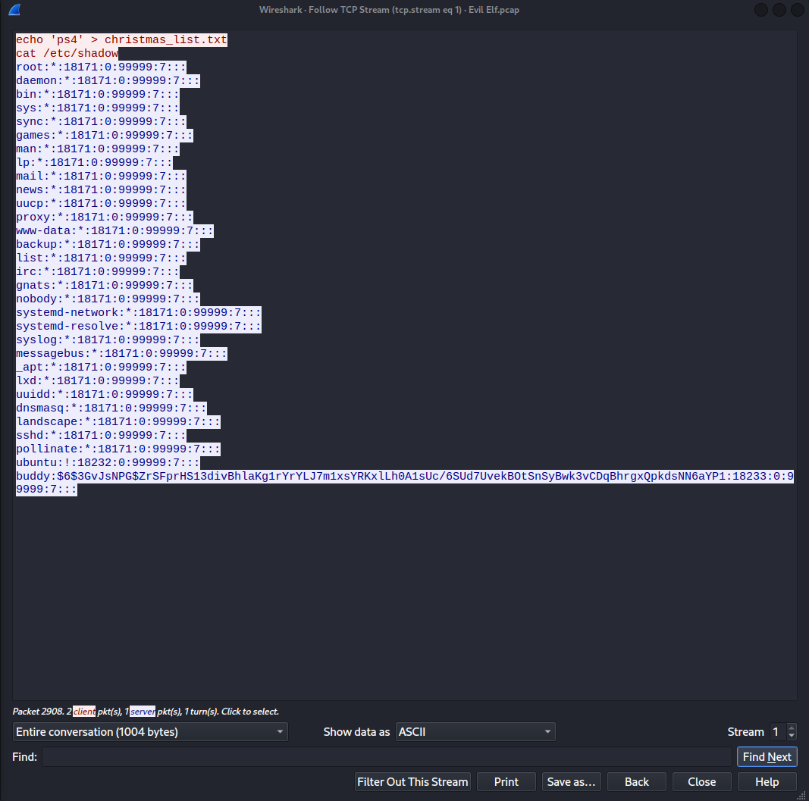
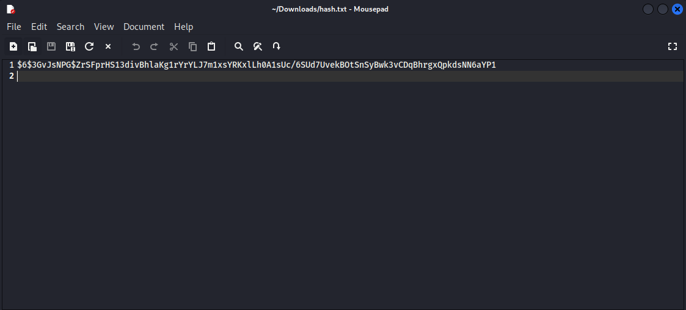
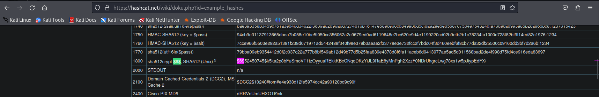
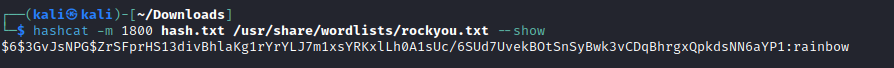

# [Day 3] Evil Elf Writeup
### Tags: `#Networking #Wireshark #Password Cracking`
#### [Machine Link](https://tryhackme.com/room/25daysofchristmas)

## Walkthrough

1.) Lets open the 'Evil Elf.pcap' file using the tool wireshark. lets find the destination IP for the packet number 998.

2.) Lets find packets from an unencrypted protocol such as Telnet.

3.) Since the telnet packets are unencrypted, we can use the follow TCP stream option and display all the clear-text data.

4.) Since we have a password hash from the etc/shadow file, we can try and crack the hash using a tool called hashcat. First create a text file only containing the second portion of the hash string.

5.) Secondly, we need to find the correct hash code for the type of hash the string is. Using the hashcat Wiki, we can see the hash type is sha512crypt and the hashcat code is 1800.

6.) Finally, we can attempt to crack the hash using hashcat. Using the CLI run the command - hashcat -m 1800 hash.txt /usr/share/wordlists/rockyou.txt

## Tasks
| Task | Question | Answer |
| --- | --- | --- |
| Task #1 | Whats the destination IP on packet number 998? | 63.32.89.195 |
| Task #2 | What item is on the Christmas list? | ps4 |
| Task #3 | Crack buddy's password! | rainbow |
