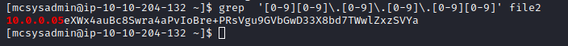

# [Day 4] Training Writeup
### Tags: `#Linux #Bash #File Structure`
#### [Machine Link](https://tryhackme.com/room/25daysofchristmas)

## Walkthrough

1.) Lets ping the machine to see if it is up and running.

2.) Lets login to a remote machine using port 22 (SSH) with username:password mcsysadmin:bestelf1234

3.) Using the command ls -la or just ls lets count all the visible files in mcsysadmin's home directory.

4.) Use the command 'cat' to output the contents of a file.

5.) Using the command 'grep', we can search for a specific string within a specific file.

6.) Using the command 'grep' with regular expressions (RegEx) we can search for specific patterns like IP addresses.

7.) Looking at the contents of the /etc/passwd file will show all accounts on the system, this includes users and service accounts.

8.) The command sha1sum will take a file and return the hash value.

9.) Normally user password hashes are stored in the /etc/shadow file, however this file is only accessible with root privileges. Backup files are a great place to find information, using the command 'find' lets search for any .bak files on the system.

10.) The shadow.bak file doesnt have the right privileges set and therefore we can read the contents.

## Tasks
| Task | Question | Answer |
| --- | --- | --- |
| Task #1 | How many visible files are there in the home directory(excluding ./ and ../)? | 8 |
| Task #2 | What is the content of file5? | recipes |
| Task #3 | Which file contains the string ‘password’? | file6 |
| Task #4 | What is the IP address in a file in the home folder? | 10.0.0.05 |
| Task #5 | How many users can log into the machine? | 3 |
| Task #6 | What is the sha1 hash of file8? | fa67ee594358d83becdd2cb6c466b25320fd2835 |
| Task #7 | What is mcsysadmin’s password hash? | $6$jbosYsU/$qOYToX/hnKGjT0EscuUIiIqF8GHgokHdy/Rg/DaB.RgkrbeBXPdzpHdMLI6cQJLdFlS4gkBMzilDBYcQvu2ro/ |

