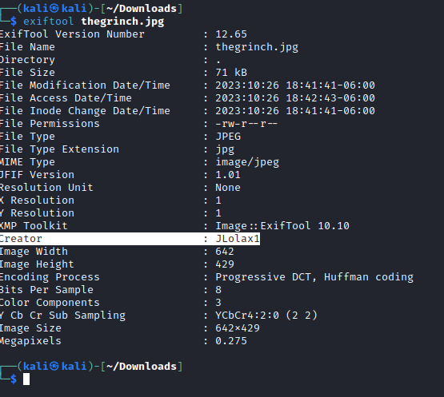
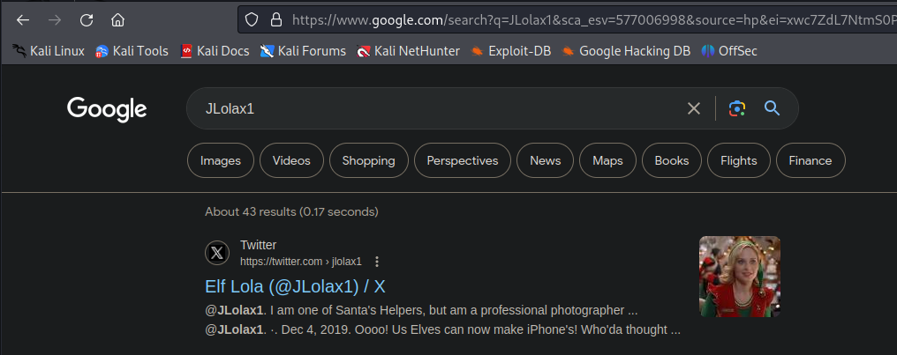
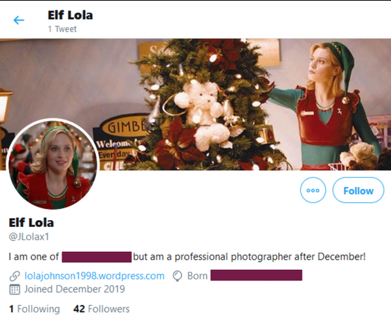
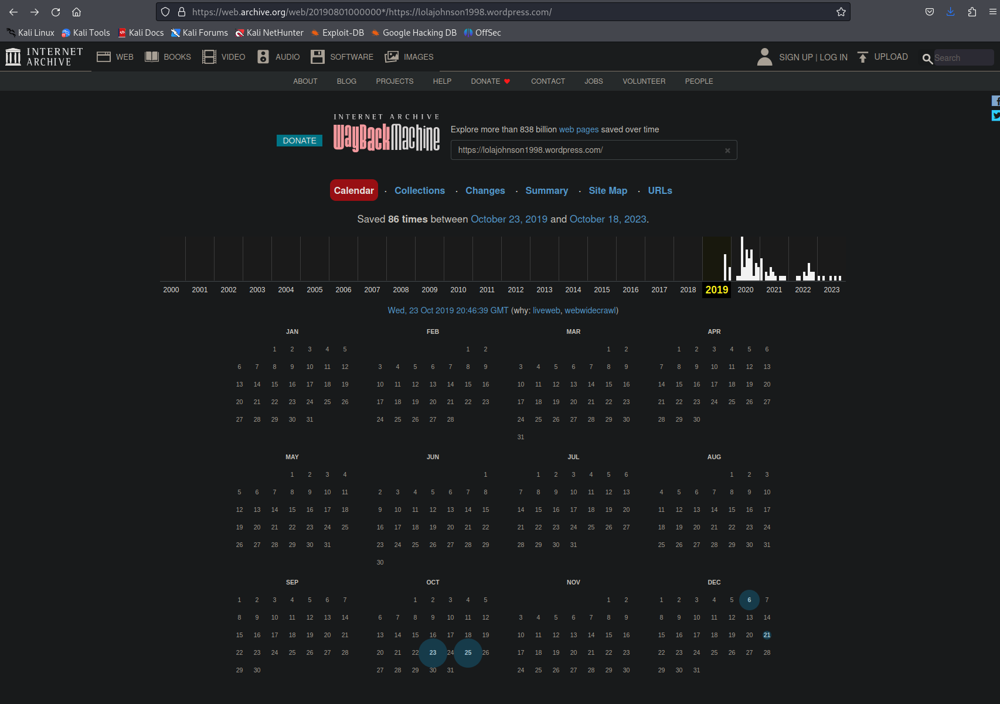
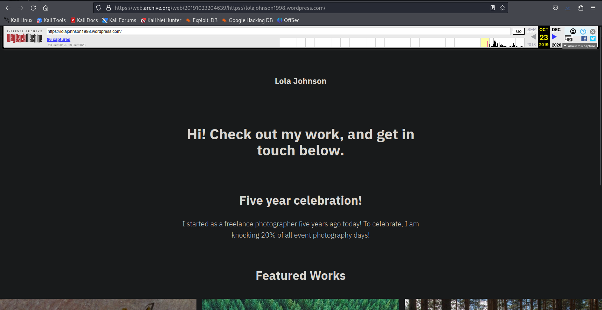
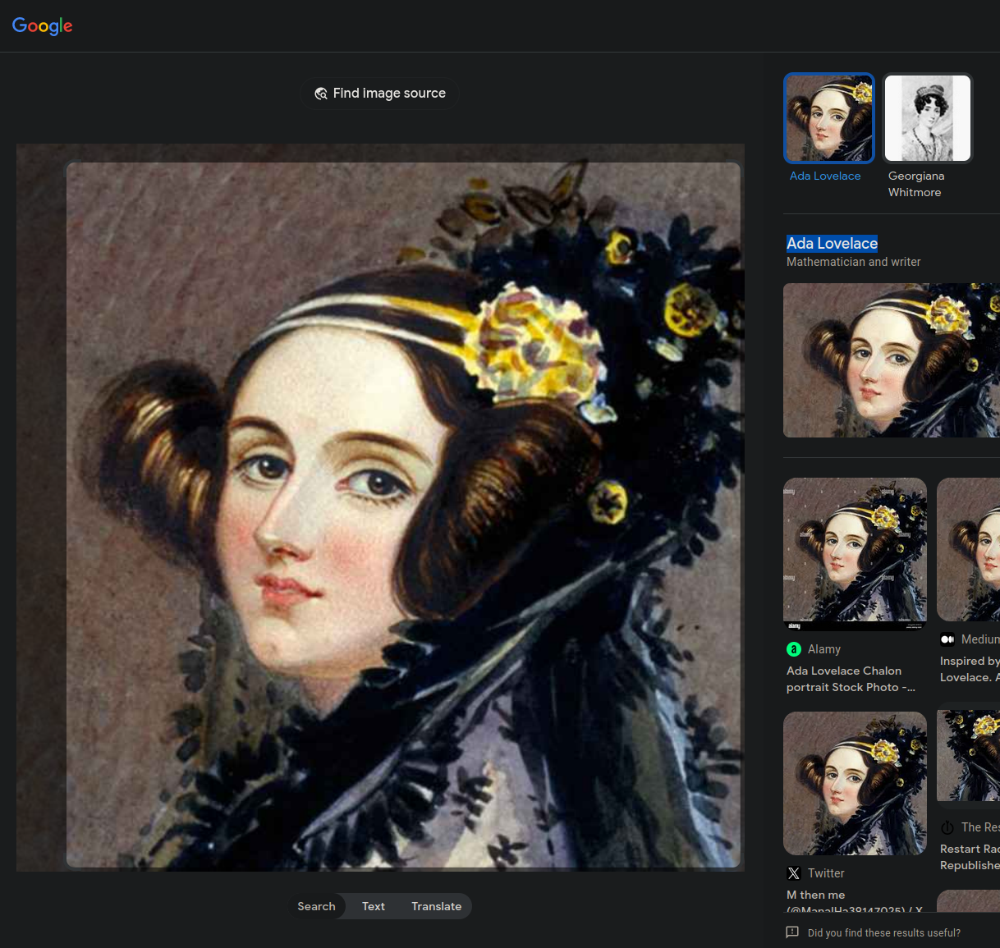

# [Day 5] Ho-Ho-Hosint Writeup
### Tags: `#OSINT #Metadata #Public Information`
#### [Machine Link](https://tryhackme.com/room/25daysofchristmas)

## Walkthrough

1.) Lets download the machine task files and open the image to view what we are working with.

2.) Using the CLI tool exiftool, we can try to find any metadata attached to the image that will be useful. We see there is a username attached to the image's metadata.

3.) Using Google, lets try to see if this username is associated with any social media accounts. The first result shows that the username is connected to a twitter/X account.

4.) The twitter account contains the user's DoB, occupation, location, and personal website. That is alot more data that is now available for OSINT research. 

5.) Using the website The Wayback Machine, we can look at previous versions of the user's personal website.

6.) We can look at the first version of the user's personal website, to see if there is any information disclosure.

7.) Using google image search and uploading a image file, we can search for all instances of that image on the web with all the related information.

## Tasks
| Task | Question | Answer |
| --- | --- | --- |
| Task #1 | What is Lola's date of birth? Format: Month Date, Year(e.g November 12, 2019) | December 29, 1900 |
| Task #2 | What is Lola's current occupation?| Santa's Helper |
| Task #3 | What phone does Lola make? | iPhone X |
| Task #4 | What date did Lola first start her photography? Format: dd/mm/yyyy | 23/10/2014 |
| Task #5 | HWhat famous woman does Lola have on her web page? | ada lovelace |

