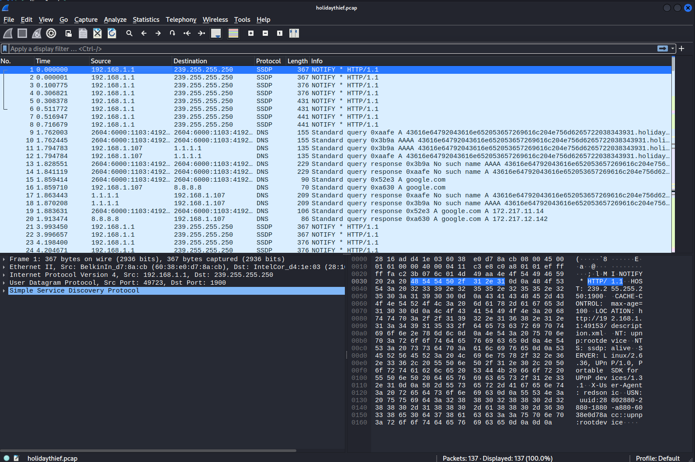
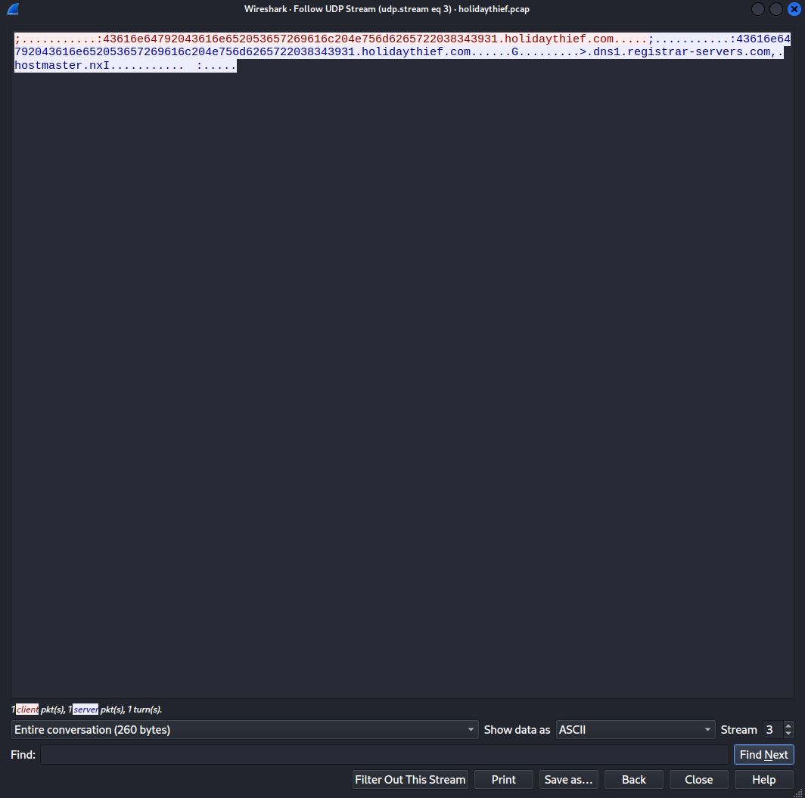
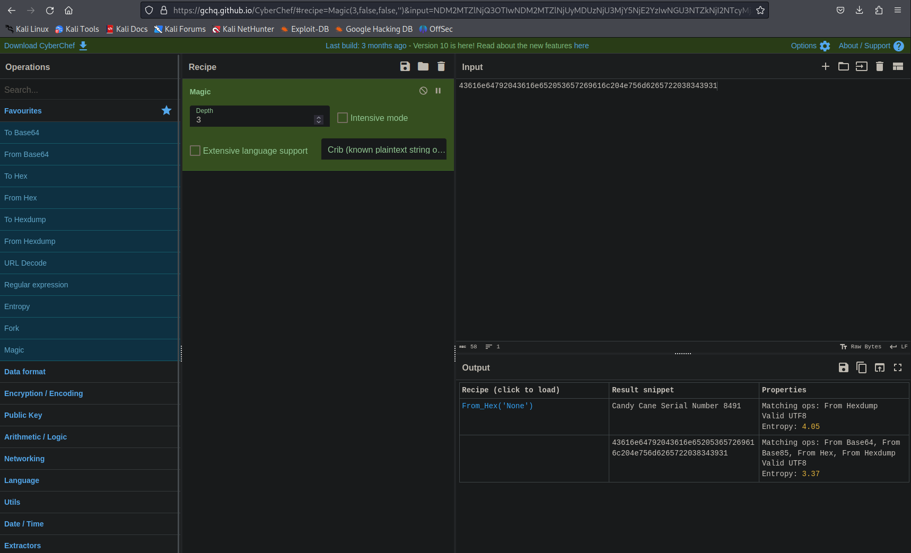
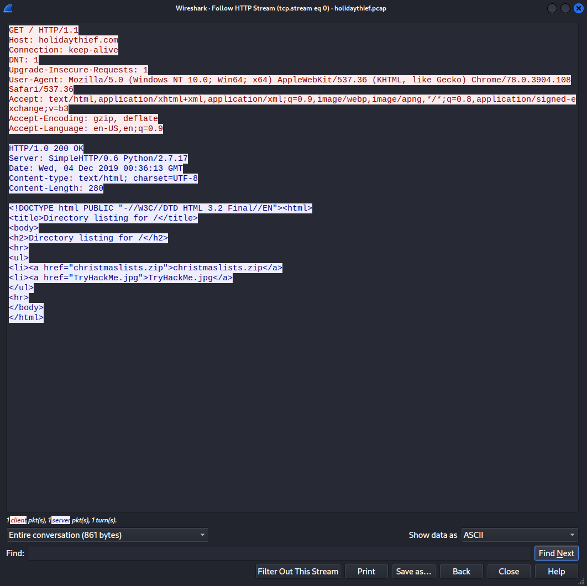

# [Day 6] Data Elf-iltration Writeup
### Tags: `#Data Exfiltration #Steghide #fcrackzip`
#### [Machine Link](https://tryhackme.com/room/25daysofchristmas)


## Walkthrough

1.) Lets download the machine task files and open the pcap file with the tool wireshark.

```bash
wireshark holidaythief.pcap
```



2.) By looking through the pcap file, we can see alot of packets using unencrypted protocols such as DNS and HTTP. These packets can be reconstructed and we can see all the data the packet contains. Lets reconstruct the DNS stream and see if any data looks interesting.



3.) The subdomain string for holidaythief.com looks very out of place, it looks like the string is hex encoded. Using CyberChef, lets decode the string and see if any data was trying to be exfiltrated out of the network throught this packet.



4.) Going back to the pcap file, lets take a look the the HTTP stream for all the HTTP packets and see if any data looks interesting. 



5.) 


6.) 


7.) 


## Tasks
| Task | Question | Answer |
| --- | --- | --- |
| Task #1 | What is Lola's date of birth? Format: Month Date, Year(e.g November 12, 2019) | December 29, 1900 |
| Task #2 | What is Lola's current occupation?| Santa's Helper |
| Task #3 | What phone does Lola make? | iPhone X |


