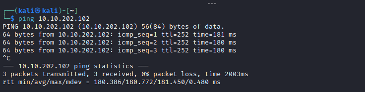
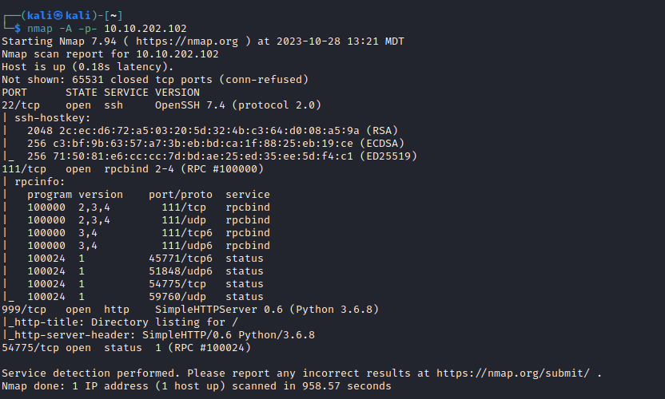
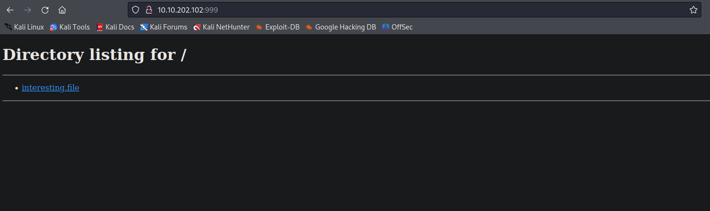

# [Day 7] Skilling Up Writeup
### Tags: `#Networking #Ports #NMAP`
#### [Machine Link](https://tryhackme.com/room/25daysofchristmas)


## Walkthrough

1.) Lets ping the machine to see if it is up and running.

```bash
ping 10.10.202.102
```



2.) Lets run an nmap scan on the machine that will use the TCP protocol to scan all the ports and get back the most information from the machine as possible.

```bash
nmap -A -p- 10.10.202.102
```



3.) This machine is showing a open http service (web application) on port 999, lets take a look and see if we can find any interesting information.



## Tasks
| Task | Question | Answer |
| --- | --- | --- |
| Task #1 | how many TCP ports under 1000 are open? | 3 |
| Task #2 | What is the name of the OS of the host? | Linux |
| Task #3 | What version of SSH is running? | 7.4 |
| Task #4 | What is the name of the file that is accessible on the server you found running? | interesting.file |


